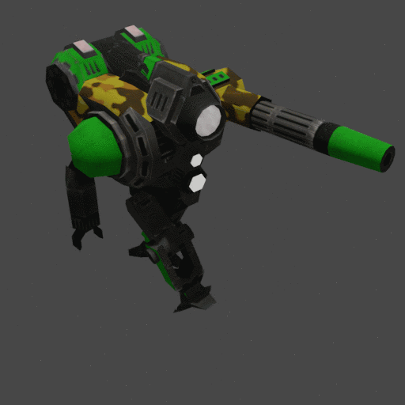

# Usage Guide:
READ THE TUTORIAL / DOCUMENTATION HERE: https://docs.google.com/document/d/1-oMLkWHBhfN6a3a5aEZU6X02lY4aZE52nZRtrvIe4cM/edit?usp=sharing

Video Tutorial:

https://www.youtube.com/watch?v=DaMLNfOR6KU

# Skeletor_S3O
A blender script that automatically generates a skeleton for an s3o imported model for SpringRTS animation

Usage:

1. Register the script with blender 2.80+ 

2. Go into object mode and select the root piece (pelvis/base) of the model

3. Press the "Create Skeleton" button

4. You can now go into Pose mode and flail the appendages around. 

5. If inverse kinematics is somehow not perfectly set up automagically, I recommend watching this video, in 5 minutes it will explain things better than I ever could.

https://www.youtube.com/watch?v=gH5uATTTYB4

6. Export to BOS.

