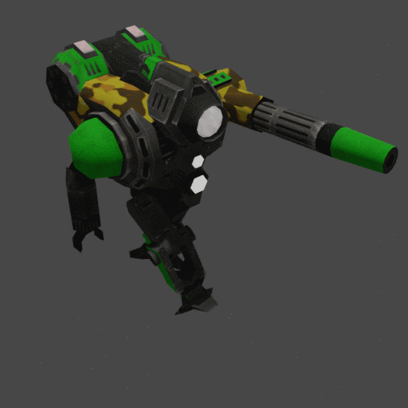

# Usage Guide:
READ THE TUTORIAL / DOCUMENTATION HERE: https://docs.google.com/document/d/1-oMLkWHBhfN6a3a5aEZU6X02lY4aZE52nZRtrvIe4cM/edit?usp=sharing

Video Tutorial:

https://www.youtube.com/watch?v=DaMLNfOR6KU

# Skeletor_S3O
A blender script that automatically generates a skeleton for an s3o imported model for SpringRTS animation

Usage:

1. Register the script with any version of blender from 2.80 up to 4.3 LTS

2. Select the collection where the root piece (pelvis/base) of the model is. Make sure it's within a collection.

3. Hit Tab, type "Apply Rotation", and select Object > Apply > Rotation & Scale

4. Press the "Create Skeleton" button

5. You can now go into Pose mode and flail the appendages around. 

6. If you keep enabled "Add IK targets to chains", the addon will setup up inverse kinematics automagically for you, so you can rotate chains from a controller at its tip. If that fails for some reason, I recommend watching this video, in 5 minutes it will explain things better than I ever could:

https://www.youtube.com/watch?v=gH5uATTTYB4

7. Export to BOS, LUS (Lua Unit Script) or [LUS Tween format](https://github.com/FluidPlay/TAP/blob/main/scripts/include/springtweener.lua) by clicking the bottom buttons. The script will be created right next to where the current blender file is saved.
   - For videos showcasing the entire production workflow from a blender model, to animating it, exporting and integrating it in SpringRTS (with the SpringTweener library), check the three videos which start here: https://www.youtube.com/watch?v=W1U3WAbjXss

8. Enjoy!

## Include-ready BOS animation export

**Create BOS Includes (.h)** writes one header per selected Blender Action. Action
names must match `[A-Za-z_][A-Za-z0-9_]*`, and the Blender scene must run at 30
FPS. A generated header defines only `Start<Action>()` and `Stop<Action>()`, so
several Actions can be included by one unit without duplicate policy or callback
definitions. The authored animation is the 100% reference at `MAX_SPEED`.

Variable Speed samples `CURRENT_SPEED` synchronously before every keyframe and
preserves uneven source intervals. Variable Amplitude scales move and turn
deviations around the first-frame stance. Variable Scale remains the independent,
compile-time `MOVESCALE` model calibration. With Variable Amplitude but without
Variable Speed, the owning unit may set `VA_amplitude` manually.

A complete owning-script setup looks like this:

```bos
#include "constants.h"

piece pelvis, thigh;
static-var VA_frames, VA_sleepTime, VA_amplitude, VA_timeError, VA_useAmplitude;

#define SIGNAL_MOVE 1
#define VA_TIME_PRECISION 1000
#define VA_AMPLITUDE_BLEND 50
#define VA_MIN_SPEED_PERCENT 25
#define VA_MAX_SPEED_PERCENT 150
#define VA_MIN_AMPLITUDE 50
#define VA_MAX_AMPLITUDE 125
#define VA_MIN_FRAMES 1
#define VA_MAX_FRAMES 12
#define MOVESCALE 100

#include "../variable_animation.h"
#include "myunit_Walk.h"
#include "myunit_Run.h"

StartMoving(reversing)
{
	signal SIGNAL_MOVE;
	start-script StartWalk();
}

StopMoving()
{
	signal SIGNAL_MOVE;
	call-script StopWalk();
}
```

`VA_AMPLITUDE_BLEND` selects how speed correction is divided between cadence and
amplitude: 0 is cadence-only, 100 is amplitude-only, and 50 is the recommended
equal split. The other limits are unit tuning policy. The shared module caps one
source interval at 120 frames and documents the supported COB-speed bound; keep
those constraints when choosing unusually large animation intervals or speed
buffs. Existing checked-in animations do not need migration.

## Recoil GLTF/GLB workflow

For a model imported through the S3O Blender workflow, export GLB with Blender's
`+Y up` option disabled and add the Scene custom property `s3ocompat=true`.
SuperSkeletor exports the same `YXZ` BOS/LUS axes for S3O and GLTF models because
current RecoilEngine versions convert GLTF piece data into engine coordinates
while loading. Compile the generated BOS normally: do not add `#define GLTF` or
use BARScriptCompiler's deprecated GLTF axis-remapping flags.

Enable **glTF Workflow** before exporting scripts to validate these settings. It
also warns when an animated object or bone has a non-identity local rest rotation;
that rest frame is intentionally preserved by Recoil and rotates the affected
piece's local animation axes.



