**By Beherith**

[[https://www.beyondallreason.info/]{.underline}](https://www.beyondallreason.info/)

[[https://github.com/Beherith/Skeletor_S3O]{.underline}](https://github.com/Beherith/Skeletor_S3O)

Table of contents:{width="2.34375in"
height="2.34375in"}

[[Requirements]{.underline}](#requirements)

[[Setting up S3O's in
UpSpring]{.underline}](#setting-up-s3os-in-upspring)

[[Skeleton and Inverse
Kinematics]{.underline}](#skeleton-and-inverse-kinematics)

> [[Checking the created bones/inverse
> kinematics]{.underline}](#checking-the-created-bonesinverse-kinematics)
>
> [[Stiffening joints]{.underline}](#stiffening-joints)

[[Animation]{.underline}](#animation)

> [[Walk Animations]{.underline}](#walk-animations)
>
> [[Example Walk Animation]{.underline}](#example-walk-animation)
>
> [[Useful hotkeys]{.underline}](#useful-hotkeys)
>
> [[General workflow]{.underline}](#general-workflow)
>
> [[Idle animations]{.underline}](#idle-animations)
>
> [[Death animations NEW!]{.underline}](#death-animations-new)
>
> [[Starting position - Power
> Stance!]{.underline}](#starting-position---power-stance)
>
> [[Exporting death animations and
> wrecks]{.underline}](#exporting-death-animations-and-wrecks)

[[Avoiding Gimbal Lock]{.underline}](#avoiding-gimbal-lock)

[[Exporting to BOS]{.underline}](#exporting-to-bos)

> [[NEW with 0.3.1: Variable scale BOS
> scripts]{.underline}](#new-with-0.3.1-variable-scale-bos-scripts)
>
> [[BOS integration checklist:]{.underline}](#bos-integration-checklist)

[[Troubleshooting]{.underline}](#troubleshooting)

> [[My BOS output is empty]{.underline}](#my-bos-output-is-empty)

[[Youtube Sources]{.underline}](#youtube-sources)

# Requirements

1.  Blender v2.82a (Seems that higher than 2.8 has issues with importing
    s3os,, and lower than 2.8 doesn\'t work at all)

2.  The scripts from:
    [[https://github.com/Beherith/Skeletor_S3O]{.underline}](https://github.com/Beherith/Skeletor_S3O)

3.  Register the s3o_import.py script and the skeletorscript.py from the
    repository as a plugin in blender's preferences. This is mandatory.

4.  UpSpring - to correct s3o hierarchies if needed

# Setting up S3O's in UpSpring

- The origins of pieces should be at sane positions for each piece.

- Pelvis should be the midpoint of the pelvis object.

- Left and right arms and feet. The origins of these objects should be
  exact mirrors of each other, so the animations can be mirrored too
  (less work, more fun!)

- Aimx1 and Aimy1 points:These should allow for fully animated
  walk+aims, and less duplication on walk/walk+aim animations

  - AimY1 should coincide with the exact pos of the torso, to allow for
    nice torso anims.

  - AimX1 should be at the midpoint between the arms, at shoulder level

  - AimX and AimY should not be direct parents of each other, usually
    add the torso there

- Make note of the max velocity of your unit (elmos/frame). You will
  need to know this to ensure that feet move in sync with the ground.

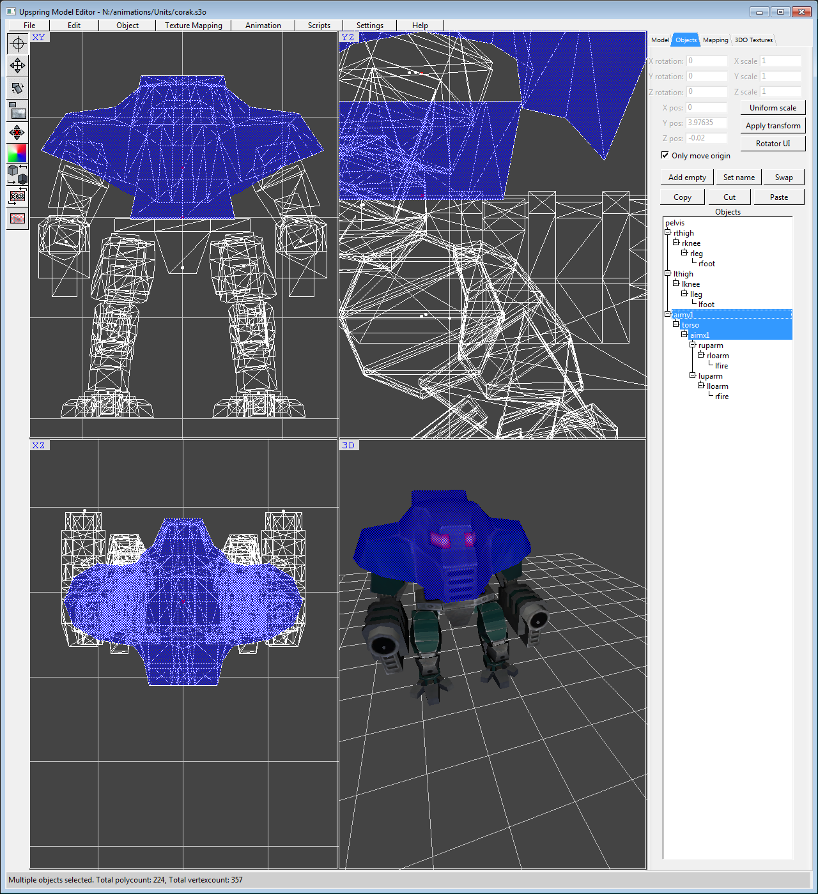{width="6.5in" height="5.520833333333333in"}

# Skeleton and Inverse Kinematics

Familiarize yourself with the way things are set up with the example
corshiva blend file in the repo
([[https://github.com/Beherith/Skeletor_S3O/blob/master/corshiva_anim_v5_bos_out.blend]{.underline}](https://github.com/Beherith/Skeletor_S3O/blob/master/corshiva_anim_v5_bos_out.blend)
)

Add the
[[skeletorscript.py]{.underline}](https://github.com/Beherith/Skeletor_S3O/blob/master/skeletorscript.py)
script to blender (or just use the corshiva blend file and just delete
all the objects from it) from the repository as a plugin in blender's
preferences. This is mandatory.

**Import the model into blender via the Import Spring ZY S3O menu in
blender.**

~~Select the pelvis (or root piece) of the model.~~

**Deselect everything, then Click on Scene Collection in the top
right:**

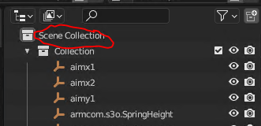{width="3.4479166666666665in"
height="1.6666666666666667in"}

Click the 1. Create Skeleton button in the SkeletorS3O panel on the
right of the 3D view. If the side panel is not visible, click the little
arrow in the top right corner (circled where that tiny arrow should be
on image below) to bring it up.

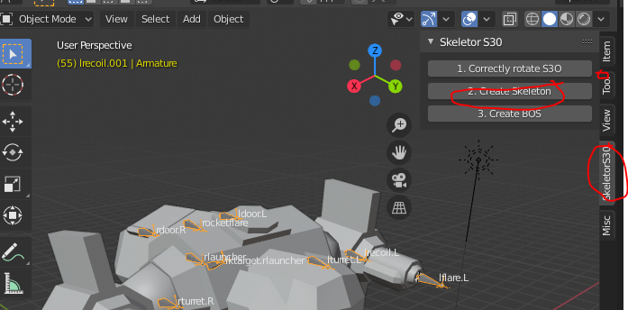{width="6.5in"
height="3.2083333333333335in"}

## Checking the created bones/inverse kinematics

Spend 10 minutes watching these two videos, they give a better rundown
of IK than I ever could.

Basic Bones and rigging:
[[https://www.youtube.com/watch?v=cp1YRaTZBfw]{.underline}](https://www.youtube.com/watch?v=cp1YRaTZBfw)

Basic inverse kinematics:
[[https://www.youtube.com/watch?v=gH5uATTTYB4]{.underline}](https://www.youtube.com/watch?v=gH5uATTTYB4)

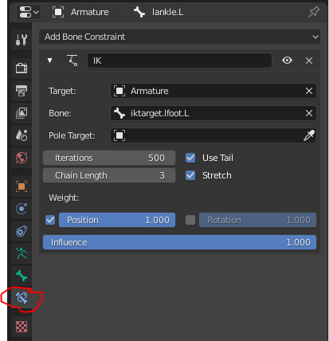{width="4.302083333333333in"
height="4.458333333333333in"}

Note that we will not use inverse kinematics poles in the animations,
instead I stiffen the Z axis joints, as poles are more problematic to
work with for elbows and knees.

The skeleton creator can be a little bit overzealous in placing inverse
kinematics targets on all appendages. You can disable/edit these in pose
mode (select a bone, choose pose mode from top left dropdown menu).

You can tune the chain lengths and targets here. **Setting chain lengths
to zero means all pieces up to root will be in IK.**

## 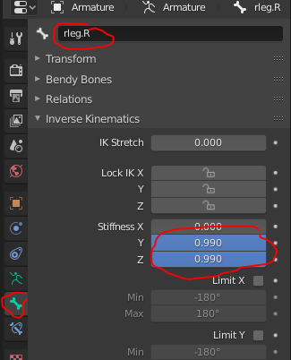{width="3.3854166666666665in" height="4.1875in"}

## Stiffening joints

You can also stiffen joints along various axes, setting knees, and
ankles like this is good. Bone properties -\> Inverse Kinematics -\>
Stiffness.

**Another method of keeping the feet always level, and not pointing
everywhere is by setting Bone Constraints -\> IK -\> Rotation checkbox.
THIS IS THE ABSOLUTE EASIEST AND BEST METHOD TO DO ANIMATIONS**

{width="4.197916666666667in"
height="4.114583333333333in"}

You can also show/hide bone names on the skeleton:
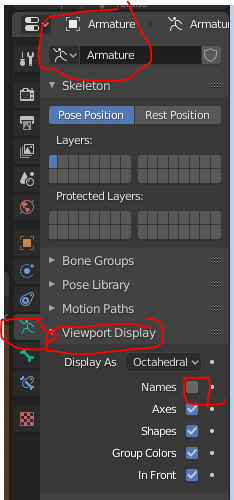{width="2.4375in"
height="5.208333333333333in"}

# Animation

Once satisfied with the skeleton (move/rotate the bones and IK targets
around), you can begin on your animation.

Set Blender to interpolate linear for walk scripts in
Edit-\>Preferences. For death and idle you might want to use some other
to export a high-detail anim.

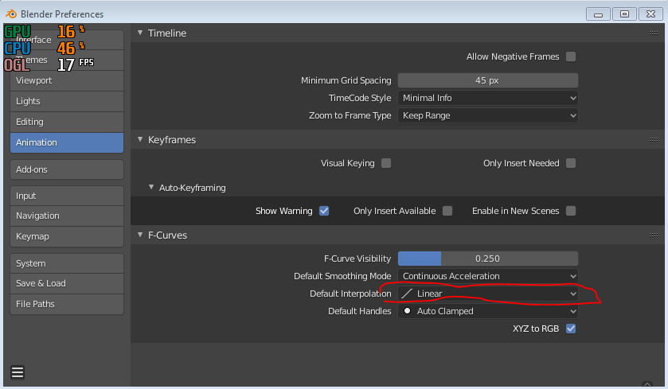{width="6.5in"
height="3.7916666666666665in"}

## Walk Animations

Decide if you want a 6 or 8 or 10 or 12 keyframe walk animation, this is
largely governed by the speed/size of the units.

For large/slow units, you will likely want more keyframes, and for
smaller/faster units you will want less.

Set Blender's render to **30 FPS**, as Recoil animations run at that
rate.

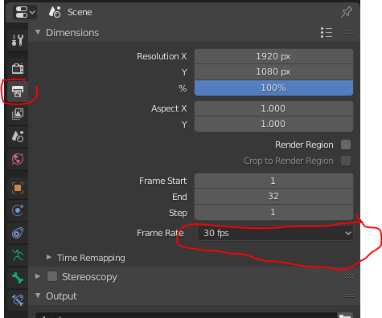{width="4.401042213473316in"
height="3.6690791776027996in"}

You want to **space the keyframes evenly**, to allow for sane speeding
up and slowing down animation when the unit isn't traveling at
maxvelocity. Make sure that the unit travels the required distance in
the allotted time

Also remember to set the animation interpolation to LINEAR.

**Tip:**

Use transformation locking in tools to set the rotation of
knees/hips/heels to be locked to the X axis. It will save you time when
doing transformations and setting keyframes as you will not have to tap
G + y, G + z every time you move a piece. Another tip is to use the side
view (NUM3) when animating legs so that you can precisely see the ground
level and all default transformations will be within ZY plane.

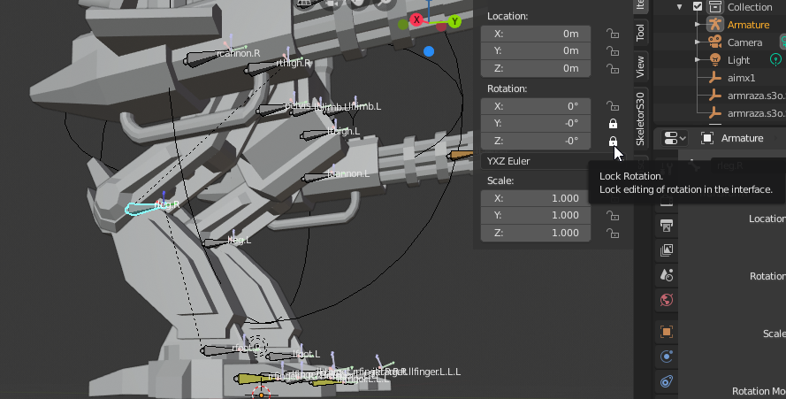{width="4.780859580052494in"
height="2.425955818022747in"}

## Example Walk Animation

Unit has a maxvelocity of 1.61 elmos/frame. I want 8 keyframes, spaced 3
frames apart.

Each walk cycle will be 24 frames in total. Thus the animation should
traverse forward 24\*1.61 elmos in a cycle.

8 Frame walk cycle, recommend starting from High-Point

[[https://sites.google.com/site/disasterbot0101/game-design/12\-\--animated-walk-cycle\-\--50pts]{.underline}](https://sites.google.com/site/disasterbot0101/game-design/12---animated-walk-cycle---50pts)

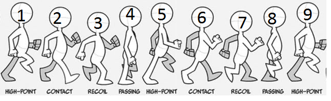{width="6.5in" height="2.0in"}

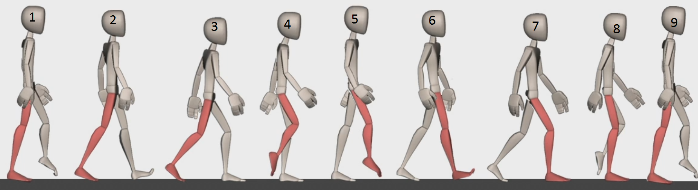{width="6.5in"
height="1.7638888888888888in"}

[[https://www.youtube.com/watch?time_continue=4&v=GlYTXs0Cyc8&feature=emb_logo]{.underline}](https://www.youtube.com/watch?time_continue=4&v=GlYTXs0Cyc8&feature=emb_logo)

I recommend using the Dope sheet in blender to do your animations:

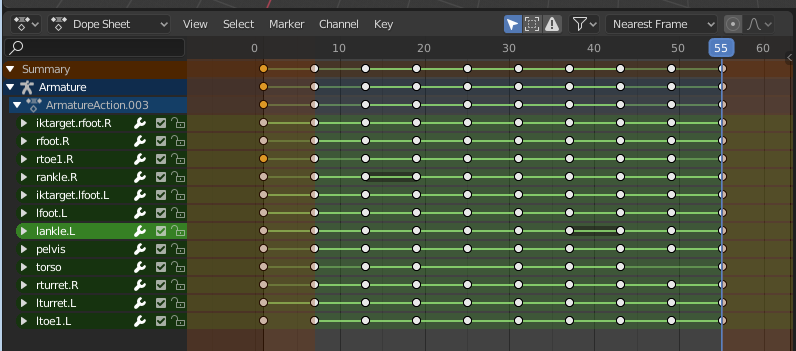{width="6.5in"
height="2.861111111111111in"}

The first keyframe at pos 1 should be the default idle position of the
unit, so the first step is animated nicely. **You can pose your unit on
the first keyframe to its 'idle' stance, does not have to be all zeros,
skeletor will handle this fine**. Make sure 'First frame stance' is
checked if you want this, otherwise idle pose will default to all zero
pose.

Don\'t leave empty keyframes on pieces, as Skeletor will have trouble
interpolating the correct speeds (e.g no keyframe for torso on frame 32
in my pic)

The last keyframe should be identical to the second keyframe (so the
animation loops correctly).

### Useful hotkeys

G - move bone, Alt+G resets movement

R - rotate bone, Alt+R resets rotation

I - Insert keyframe (choose LocRot)

Copy-paste on dopesheet, paste always pastes at cursor, Ctrl+Shift+V
MIRRORS the paste (L-R)

Left-Right keys step the timeline 1 frame at a time

Up-Down keys step to the next keyframe

Shift+Space starts and stops the animation

### General workflow

Start by setting fps to 30, having the timeline and dope sheets open,
kind of like so:

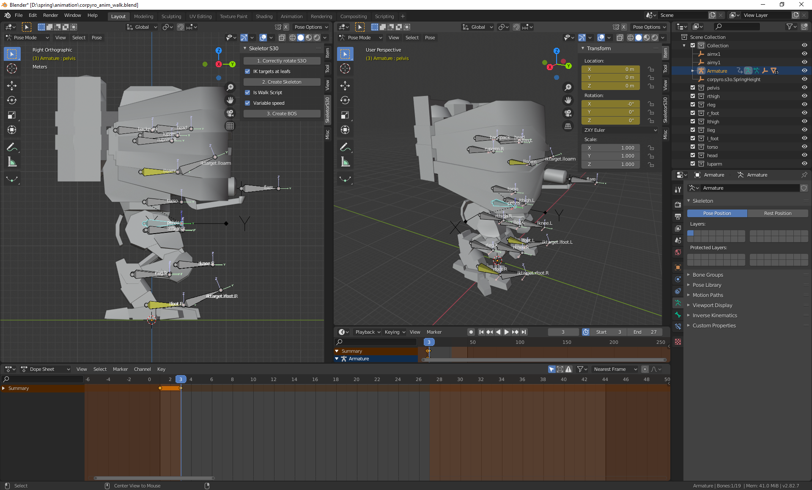{width="5.869792213473316in"
height="3.5463320209973754in"}

Turn on recording on the timeline, and set your animation loop times for
easy debugging

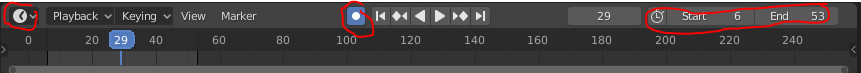{width="6.5in"
height="0.5555555555555556in"}

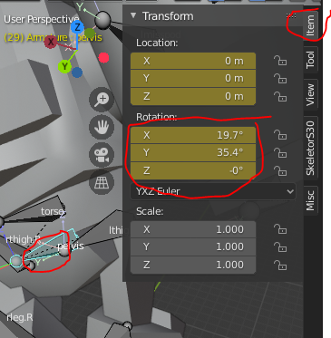{width="3.8020833333333335in"
height="3.8854166666666665in"}

Start with the pelvis bobbing up and down, and rotating it left and
right, and maybe even side to side.

It is easiest to do this by dragging or keying in values when you have
the bone selected on the Item panel in the 3D view.

You only have to animate the left or right side of the body, you can
mirror a walk cycle to the other half of a skeleton:
[[https://blender.stackexchange.com/questions/43720/how-to-mirror-a-walk-cycle]{.underline}](https://blender.stackexchange.com/questions/43720/how-to-mirror-a-walk-cycle)

On the Dope sheet, select all the keyframes of the animation.

To left-right copy an animation from one bone to the other on the dope
sheet, select all of the keyframes in the walk cycle belonging to that
bone on the dope sheet (iktarget.l_foot.L marked yellow here), and
ctrl+c to copy them.

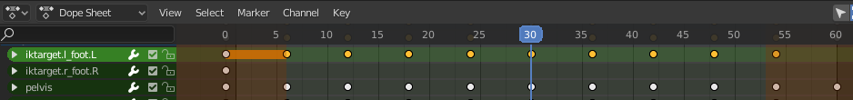{width="6.5in"
height="0.7638888888888888in"}

Now to copy them 180\* out of phase and X reversed to the other
iktarget.r_foot.R, put the timeline to the point where you want the copy
to start (30 in this case), select the iktarget.r_foot.R target bone,
and press Ctrl+Shift+V to paste it mirrored:

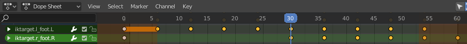{width="6.5in"
height="0.6111111111111112in"}

Select the second half of the keyframes of this bone, and copy-paste
them to the first half of the animation.

## Idle animations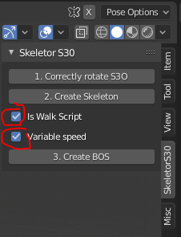{width="2.3541666666666665in" height="3.0729166666666665in"}

These do not have to have keyframes placed evenly.

Uncheck 'is walk script' and 'variable speed'.

## Death animations **NEW!**

Note that there is no real performance limit on keyframes or anything
for these. Go nuts! Uncheck 'is walk script' and 'variable speed', and
check 'Is Death Animation'

**To explode pieces off the model, move the respective bone at least 200
units away from its normal position, this is what tells the script to
hide that piece and make it fly off. All children of that piece will fly
off too.**

### Starting position - Power Stance!

It is recommended to start the death animation from the same power
stance (or neutral) pose that's in the walk animation file. Put the
first actual death keyframe about 10-15 frames from the neutral stance,
to give some time so that all animated pieces can achieve that position.
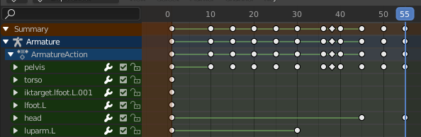{width="4.385470253718285in"
height="1.4322922134733158in"}

### Exporting death animations and wrecks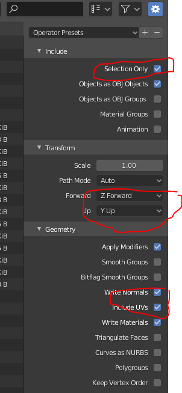{width="2.3122462817147857in" height="4.984375546806649in"}

To export a wreck model, select all non-exploded off meshes export as
OBJ (using the export settings in the image to the right) , then convert
to s3o with obj2s3o available from **or** by using Upspring, but then
remember to **left-right flip the model**, by scale X=-1, apply.

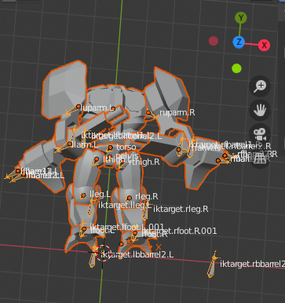{width="3.78125in"
height="4.020833333333333in"}

Checklist: Unit_dead.s3o

- Flip the model left-right (scale X=-1, apply), if needed!

- Set the texture,

- Merge the pieces

- Set model height

- Set model radius

- Set model center

- Edit-\>optimize-\>all objects

- and save as unitname_dead.s3o in Upspring.

- Set the unitdef in \\luarules\\gadgets\\unit_death_animations.lua

When editing the .bos file, ensure that aim pieces also get returned to
neutral during the death animation.

Note that a gadget must be added to your game that prevents dying units
from moving and from being selected.

# Avoiding Gimbal Lock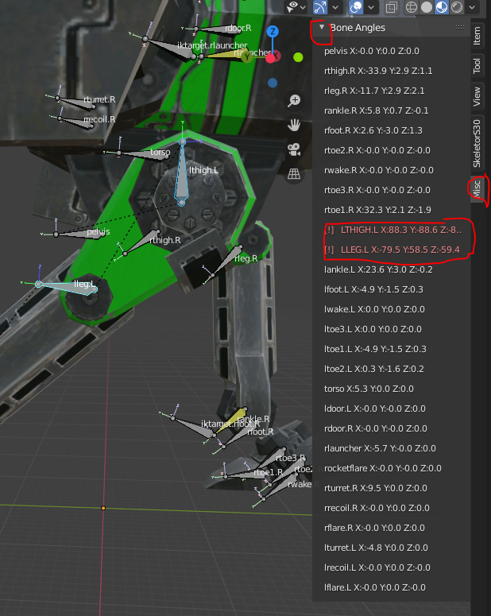{width="3.7203412073490814in" height="4.671875546806649in"}

Sometimes, especially due to the use of IK targets, when bones are
rotated \~90 degrees along their major axis, further rotations can be
affected by gimbal lock. The Bone angles panel in the Misc tab alerts
you of possible gimbal lock conditions being present at a given point in
time. Scrub through your animation and watch if any of the bone angles
go red. The recommended mitigation is to move the IK targets around a
little to prevent the joint from going into gimbal lock (as this will
look atrocious in-game). The .BOS output will also contain warnings if
it feels that there may be gimbal lock present.

Gimbal lock is a terrible thing, so it must be avoided at all costs.
Sometimes, changing bone inverse kinematics stiffness solves the issue
for one keyframe, but then makes the rest of the animation look bad.
Luckily, by clicking the diamond next to the stiffness markers, you can
also animate the stiffness properties of a bone. Thus you can set the
desired stiffness to reduce gimbal lock on one frame, and then set it
back to normal for the next and previous
frames!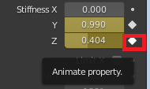{width="1.9791666666666667in"
height="1.1770833333333333in"}

# Exporting to BOS

Once satisfied with the animation, save your work in a .blend file, and
you can export it to the same folder the .blend file is in
(bos_export.txt) by clicking the Create Bos in the SkeletorS3O panel.
Copy-paste into BOS, compile and enjoy!

### [NEW with 0.3.1: Variable scale BOS scripts]{.mark}

You can now click on **Variable scale** on the SkeletorS3O panel. This
will export all move commands with a MOVESCALE parameter. This is
#define MOVESCALE 100 by default, and allows you to scale move commands
(which make scaling units easier, as turn commands are scale-invariant
by definition, move commands are not).

### BOS integration checklist:

- **#define SIG_WALK** is defined and does not overwrite any other
  signals

- SmokeUnit(): **start-script UnitSpeed();** //after get build percent
  left

- Create(): set the **animSpeed = 4;** // or whatever your keyframe
  interval is to avoid div/0 error

- AimWeaponX(): set the aimed pieces to aimy1 and aimx1, if needed

- RestoreAfterDelay(): restore aimy1 and aimx1, if needed

Known bugs: none, we just call them 'Happy accidents'. Open issues on
github!

# Troubleshooting

You can toggle the debug output of the script from the blender system
console. It probably won't be very helpful to you, but will help me in
finding out what went wrong.

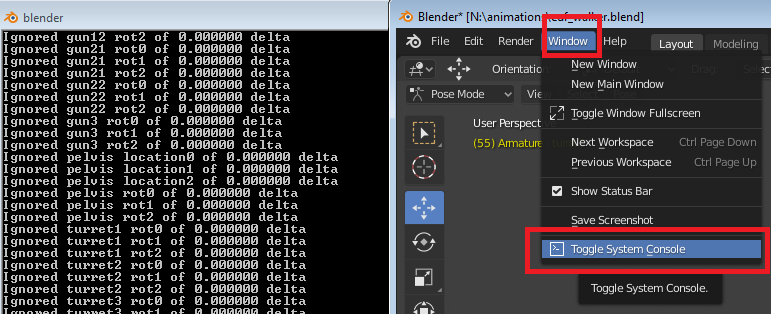{width="6.5in"
height="2.6527777777777777in"}

## My BOS output is empty

**You must add at least 1 keyframe to a bone that is NOT an iktarget at
every key frame you want exported.** E.g. in the below case, for each
iktarget bone movement, I have added a blank LocRot keyframe to the
pelvis bone. You might think you have a LocRot added, but in all cases
manually add one (hotkey i).

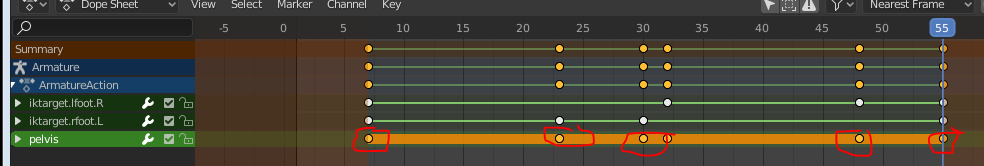{width="6.5in"
height="1.0972222222222223in"}

# Youtube Sources 

Half an hour of **highly** recommended viewing:

Full Reaminate workflow in Blender on the example of corstorm:

<https://www.youtube.com/watch?v=DaMLNfOR6KU&feature=youtu.be>

walk cycle animation blueprint: a how to guide \[8min\], use \<\> (,.)
keys to view frame by frame :)

[[https://youtu.be/GlYTXs0Cyc8?t=13]{.underline}](https://youtu.be/GlYTXs0Cyc8?t=13)

Basic Bones and rigging:

[[https://www.youtube.com/watch?v=cp1YRaTZBfw]{.underline}](https://www.youtube.com/watch?v=cp1YRaTZBfw)

Basic inverse kinematics:

[[https://www.youtube.com/watch?v=gH5uATTTYB4]{.underline}](https://www.youtube.com/watch?v=gH5uATTTYB4)

Other:

Blender Python Tutorial: An Introduction to Scripting \[Python - bpy\]

[[https://www.youtube.com/watch?v=cyt0O7saU4Q]{.underline}](https://www.youtube.com/watch?v=cyt0O7saU4Q)
